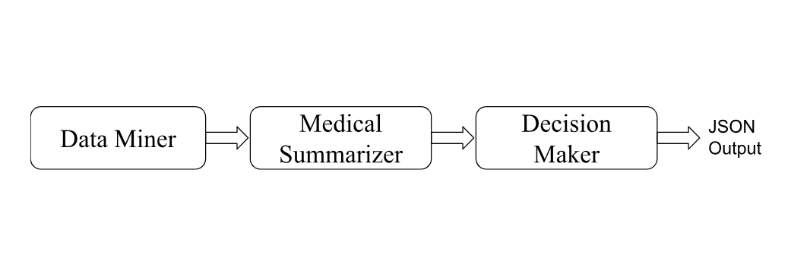

# 🩺 Health Multi-Agent System

## Overview
This project implements a **multi-agent pipeline** for processing health news using LangChain + Groq LLMs:

1. **Data Miner** → Scrapes latest health news.
2. **Medical Summarizer** → Summarizes news using LLM.
3. **Decision Maker** → Classifies into:
   - Actionable Advice
   - Informative

The system runs asynchronously with error handling and produces structured JSON output.

---

## Architecture


---

## Features
- Modular agent design
- Async orchestration with retries
- LLM-based summarization + classification
- JSON output for downstream analysis
- Error handling for API/Network failures

---

## Installation
```bash
git clone https://github.com/YOUR-USERNAME/health-multi-agent.git
cd health-multi-agent
python -m venv agent
source agent/bin/activate   # (or agent\Scripts\activate on Windows)
pip install -r requirements.txt

